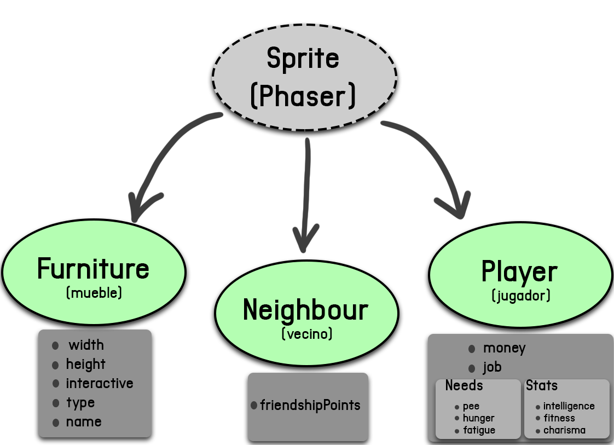

# **Classes and properties**

  

- Sprite (Phaser)
  > Properties
  >* Pos x, Pos y
  >* Sprite
   - Neighbour:
     > Properties
      >- Friendship
   * Player
     > Properties
      >- Money
      >- Needs
      >- Job (object)
            1.Pee 
            2.Hunger 
            3.Fatigue 
      >- Stats (object)
          1.Intelligence 
          2.Fitness 
          3.Charisma 
      
    * Furniture
      >Properties
        >+ Interactive (bool)
      >+ Type (bed, door, fridge, toilet)
      >+ Name (bed1, bed2, fridge1)
      >+ Width, Height
        
        
        
## RetroSims

  

 
<b>
 David Carmona Fauste y Mario Tabasco Vargas
</b

  

