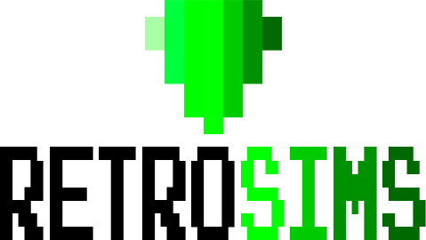

## RetroSims

  

 
<b>
 David Carmona Fauste y Mario Tabasco Vargas
</b

  

* **English version [here](#index).**

### Índice
1. [Descripción](#descripción)
2. [Mecánicas](#mecánicas)
3. [Aspecto visual](#aspecto-visual)
4. [Clases](#clases)

### Descripción
RetroSims es una adaptación de Los Sims a una
estética 8 bits para navegador, tratando de transmitir la esencia de estos juegos a través de sus mecánicas principales. El juego tiene vista cenital, está distribuido en casillas y el movimiento es
al estilo de los RPG clásicos (por ejemplo, los primeros Pokémon).

### Mecánicas
Las mecánicas principales del juego son:
1. **Creación del personaje**:
  
      El juego empieza con la creación de tu personaje. Tendrás que ponerle un nombre
      a tu personaje y elegir su sexo. También podrás seleccionar entre 
      varias apariencias de personaje y distribuir algunos puntos entre tus atributos (**Inteligencia**, **Físico** o **Carisma**). 
  
2. **Trabajos**:

      Una vez hecho tu personaje, deberás elegir un trabajo para empezar a ganar dinero.
      Para ello tendrás que enviar tu CV a uno de los trabajos disponibles.
      Tendrás una probabilidad de que te cojan dependiendo de tu nivel en los distintos atributos.
  
      Los trabajos a los que te puedes presentar también dependen de tus atributos.

      Existen tres categorías:
      * Rango 0: Dependiente de ferretería. No requiere un nivel mínimo en ningún atributo.
      * Rango 1: Científico becario (INT), entrenador de gimnasio (FIS), 
      animador de hotel (CAR).
      Para acceder a los trabajos de este nivel se necesita tener el atributo
      correspondiente a cada profesión a un nivel mínimo. 
      * Rango 2: Científico del CERN (INT), bodybuilder profesional (FIS),
      estrella del rock (CAR).
      Para estos trabajos es necesario alcanzar el máximo en el atributo que corresponda.
    
    
3. **Modo Decoración**:
      
      Puedes entrar en el **Modo Decoración** para mover o colocar muebles en tu casa.
      Tu casa ya viene amueblada cuando la compras, pero si quieres más muebles tendrás que comprarlos 
      a través de un ordenador colocado en tu casa.
      Cada objeto ocupa un número determinado de casillas y no se puede superponer con otros muebles.
  
      
      
      Ejemplo de plano de la casa del jugador.
  
  
4. **Necesidades de tu Sim**:
      
      Tu sim tiene unas necesidades básicas que debe suplir para sobrevivir. Estas son:
      - Alimentarse. Para alimentar a tu sim necesitas una nevera de donde coger los alimentos (que cuestan dinero).
      - Dormir. Necesitas una cama para que tu sim descanse.
      - Vejiga. Tu sim necesita ir al retrete cada cierto tiempo.
      Si un medidor de alguna de las necesidades llega a 0, tu sim muere.
  
5. **Interacciones**:
      
      Las interacciones, tanto con objetos como con otros sims, son en forma de menús. 
      Para interactuar con ellos tienes que acercarte y pulsar el botón de Interactuar, se te desplegará
      un menú con las opciones disponibles para interactuar con ese sim/objeto.

## Aspecto visual
Usamos sprites sencillos de 8x8 píxeles para darle una estética retro al juego.

   

## Clases
Puedes ver la estructura de clases que estamos utilizando [aquí](https://github.com/DavidCarmonaFauste/Retro-Sims/blob/master/Classes.md).

______________________________________________________________________________________________________________________________________

### Index
1. [Description](#description)
2. [Mechanics](#mechanics)
3. [Visuals](#visuals)
4. [Classes](#classes)

### Description
RetroSims is an 8-bit aesthetic adaptation of The Sims for browsers, in which we try to reproduce the feeling of these games through their main mechanics. RetroSims is a top-down view, four-directional movement game laid out in squares, in a classic RPG style.

### Mechanics
The main mechanics are:
1. **Character Creation**:
  
      The game starts with the creation of your character. You will have to introduce a name and select a gender. You can also choose between different looks and distributes some points between your stats (**Intelligence**, **Fitness** or **Charisma**). 
  
2. **Jobs**:

      Once you have your character created, you should find a job to start earning some money. To do this, you must send your CV to one of the available jobs. The chance of getting the job depends on your stats.
  
      The jobs you can apply for also depend on your stats.

      There are three ranks:
      * Rank 0: Shop assistant. No stats are require.
      * Rank 1: Science intern (INT), gym trainer (FIT), 
      animador de hotel (CHA).
      To apply for these jobs you need the corresponding stat increased to a minimum level.
      * Rank 2: CERN Scientist (INT), professional bodybuilder (FIT),
      rock star (CHA).
      To apply for these jobs you need the corresponding stat increased to its highest level.
    
    
3. **Decoration Mode**:
      
      You can enter **Decoration Mode** to move and place furniture in your house. When you buy your house, it is already furnished with some basic furniture, but you can buy more through your PC.
      Each piece of furniture take up a number of squares and can't overlap other objects.
  
      
  
  
4. **Needs**:
      
      You must take care of your sim's needs. These are:
      - Hunger. To feed your sim you need a fridge where you store food (which cost money).
      - Fatigue. You need a bed for your sim to rest.
      - Pee. Your sim needs to go to the toilet from time to time.
      If any of the needs' progress bars reaches 0, your sim dies.
      
      
5. **Interactions**:
      
      Interactions, both with furniture and other sims, are managed through menus. 
      To interact, you need to stand next to the object and press the *interact* button. A menu will open with the available interactions.

## Visuals
We use simple 8x8 sprites to achieve a retro aesthetic.

   

## Classes
You can see our classes structure [here](https://github.com/DavidCarmonaFauste/Retro-Sims/blob/master/Classes.md).
