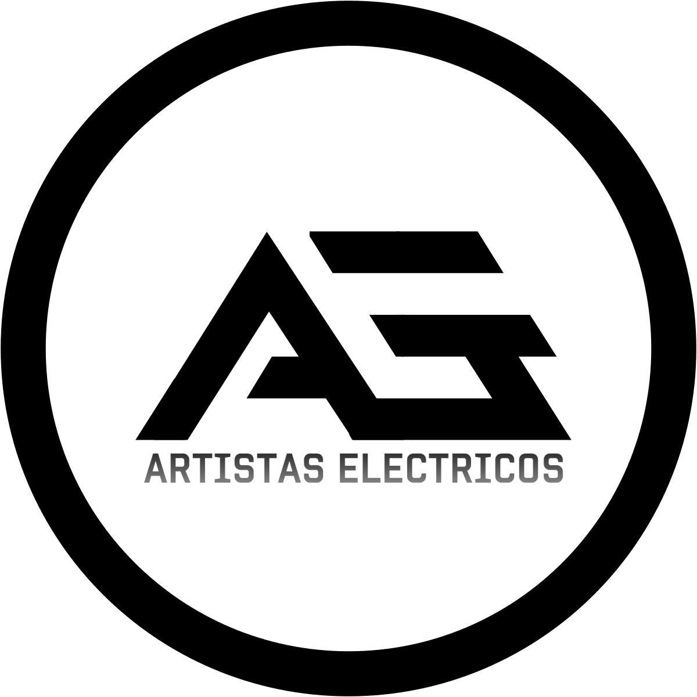

# RetroSims
### David Carmona Fauste y Mario Tabasco Vargas

### Descripción
RetroSims es una adaptación de Los Sims a una
estética 8 bits, tratando de transmitir la esencia de estos juegos a través de sus
mecánicas principales. El juego tiene vista cenital, está distribuido en casillas y el movimiento es
al estilo de los RPG clásicos (por ejemplo, los primeros Pokémon).

### Mecánicas
Las mecánicas principales del juego son:
1. Creación del personaje:
  El juego empieza con la creación de tu personaje. Tendrás que ponerle un nombre
  a tu personaje y elegir su sexo. También podrás seleccionar entre 
  varias apariencias de personaje y distribuir algunos puntos entre tus atributos (**Inteligencia**, **Físico** o **Carisma**). 
  
2. Trabajos:
  Una vez hecho tu personaje, deberás elegir un trabajo para empezar a ganar dinero.
  Para ello tendrás que enviar tu CV a uno de los trabajos disponibles.
  Tendrás una probabilidad de que te cojan dependiendo de tu nivel en los distintos atributos.
  
    Los trabajos a los que te puedes presentar también dependen de tus atributos.

    Existen tres categorías:
    * Rango 0: Dependiente de ferretería. No requiere un nivel mínimo en ningún atributo.
    * Rango 1: Científico becario (INT), entrenador de gimnasio (FIS), 
    animador de hotel (CAR).
    Para acceder a los trabajos de este nivel se necesita tener el atributo
    correspondiente a cada profesión a un nivel mínimo.
    * Rango 2: Científico del CERN (INT), bodybuilder profesional (FIS),
    estrella del rock (CAR).
    Para estos trabajos es necesario alcanzar el máximo en el atributo que corresponda.
    
3. Modo Edición
  Puedes entrar en el **Modo edición** para mover o colocar muebles en tu casa.
  Tu casa ya viene amueblada cuando la compras, pero si quieres más muebles tendrás que comprarlos 
  a través de un ordenador colocado en tu casa.
  Cada objeto ocupa un número determinado de casillas y no se puede superponer con otros muebles.
  
4. Necesidades de tu Sim
  Tu sim tiene unas necesidades básicas que debe suplir para sobrevivir. Estas son:
  - Alimentarse. Para alimentar a tu sim necesitas una nevera de donde coger los alimentos (que cuestan dinero).
  - Dormir. Necesitas una cama para que tu sim descanse.
  - Vejiga. Tu sim necesita ir al retrete cada cierto tiempo.
  Si un medidor de alguna de las necesidades llega a 0, tu sim muere.
  
5. Interacciones
  Las interacciones, tanto con objetos como con otros sims, son en forma de menús. 
  Para interactuar con ellos tienes que acercarte y pulsar el botón de Interactuar, se te desplegará
  un menú con las opciones disponibles para interactuar con ese sim/objeto.
